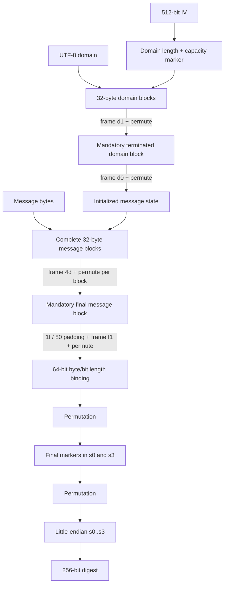

# Asterion-256 — Design Notes

This document explains the intent behind Asterion-256 v0.1.0. It is descriptive, not a security proof.

## Goals

The August 2026 prototype was designed to explore a compact, readable 64-bit ARX sponge-style hash with:

- a small fixed state;
- streaming operation;
- explicit rate/capacity separation;
- domain separation;
- structural framing;
- strong visible diffusion;
- simple independent reimplementation;
- no table lookups or secret constants.

The design deliberately favors clarity over performance tuning.

## Non-goals

Asterion-256 was **not** designed as a drop-in replacement for SHA-256, SHA-3, BLAKE2, BLAKE3, password hashing, signatures, MACs, or key derivation.

No claim is made that the construction reaches the generic bound implied by its capacity.
## State geometry

The state has eight 64-bit lanes:

```text
            512-bit state
┌─────────────────────────────────┐
│ rate (256)      │ capacity (256)│
│ s0 s1 s2 s3     │ s4 s5 s6 s7  │
└─────────────────────────────────┘
```

Only lanes 0–3 directly absorb message bytes. Lanes 4–7 are never directly overwritten by input bytes and carry capacity-side state, framing, and length information.

The 256-bit capacity means the construction should never be described as offering 256-bit security merely because its digest is 256 bits.

## Permutation structure

Each of 14 rounds performs:

```text
round-constant injection
          ↓
local ARX mixing
  [0 1 2 3]   [4 5 6 7]
          ↓
cross-state ARX mixing
  [0 5 2 7]   [4 1 6 3]
          ↓
lane braid
          ↓
round-dependent lane rotations
```
The mixer uses only 64-bit addition, rotation, and XOR. The local phase mixes each 256-bit half internally; the cross phase couples the rate and capacity halves; the braid relocates lanes before the next round.

The asymmetric rotation schedules are intended to avoid obvious mirror symmetry. They were selected heuristically, not through a published search for optimal differential or linear properties.

## Why 14 rounds?

Fourteen was a conservative prototype choice, not the result of an attack bound.

Development-time diffusion experiments show that sampled one-bit state differences approach approximately half of all state bits after two rounds, but **fast avalanche is not a security argument**. It does not establish resistance to differential, rotational, linear, algebraic, rebound, or other structural attacks.

There is currently no quantified reduced-round attack threshold and therefore no defensible statement such as "N rounds of security margin." Establishing one is open research.

## Round constants

The 14 round constants begin with:

```text
243f6a8885a308d3
13198a2e03707344
a4093822299f31d0
...
```

They are the familiar fixed hexadecimal digits of π used as public "nothing-up-my-sleeve" material in prior cryptographic designs. Their role is symmetry breaking; their origin is not evidence of security.
## Initialization vector

The first four IV words are transparent ASCII identifiers:

```text
4153544552494f4e  "ASTERION"
2d3235362f415258  "-256/ARX"
53504f4e47452f52  "SPONGE/R"
4154453d32353621  "ATE=256!"
```

The remaining four words are fixed legacy parameters from the original August prototype:

```text
9e3779b97f4a7c15
d1b54a32d192ed03
94d049bb133111eb
8538ebc64b43a1d7
```

Some are recognizable constants used in SplitMix-style generators. The original prototype did not preserve a complete derivation note for all four numeric IV words. For v0.1.0 they are therefore documented as **frozen legacy constants**, not presented as newly derived nothing-up-my-sleeve values.

A future incompatible version should either retain them with explicit historical provenance or replace them using a fully reproducible derivation procedure.

## Framing

Asterion separates domain blocks, message blocks, and the final message block with distinct frame values.

This is intended to prevent equal 32-byte payloads in different structural roles from entering the permutation identically.

Domain material also gets a mandatory terminating block, including when its encoded length is an exact multiple of the 32-byte rate.
## Domain separation

The domain is UTF-8 encoded before absorption. Domain initialization includes:

- a domain-length injection;
- a fixed capacity-side marker;
- frame `0xd1` for complete domain blocks;
- a mandatory terminated block with frame `0xd0`.

The default domain is `Asterion-256`.

Domain separation is a namespacing mechanism, not a MAC and not a substitute for keyed hashing.

## Message padding and length binding

Messages use a mandatory final block containing a `0x1f` start marker and a `0x80` end-of-rate marker.

After the final block, byte and bit lengths are mixed into capacity lanes before a finalization barrier.

The length binding is 64-bit. The normative profile therefore recommends messages shorter than `2^64` bytes.

## Finalization barrier

Asterion performs one full permutation after length binding, injects a final marker, and performs a second full permutation before exposing output.

The purpose is to separate the final digest state from the state directly following ordinary absorption.
## Output

The digest is lanes 0–3 serialized little-endian, for 256 output bits.

No extendable-output mode is defined by v0.1.0.

## Current empirical checks

Development checks, which are intentionally not presented as cryptanalysis, have observed:

- exact one-shot/streaming equivalence across tested boundary lengths;
- no collisions in a 20,000-input smoke test;
- approximately 50% output-bit balance over sampled sequential inputs;
- approximately 50% avalanche behavior for sampled single-bit message changes;
- fast state diffusion in sampled reduced-round experiments;
- no obvious simple one-bit rotational relation in a small full-round smoke test.

These checks can detect implementation mistakes or glaring statistical defects. They cannot establish cryptographic security.

## Open cryptanalytic questions

Useful outside review includes:

- differential trails and bounds by round count;
- rotational and rotational-XOR characteristics;
- linear and differential-linear analysis;
- algebraic degree growth;
- invariant subspaces or weak-state classes;
- rebound-style distinguishers;
- meet-in-the-middle structure;
- reduced-round collisions, preimages, or distinguishers;
- multicollision/herding implications of the sponge profile;
- effects of the specific braid and rotation schedule;
- whether 14 rounds provides any meaningful security margin.
## Version discipline

Asterion-256 v0.1.0 is frozen by SPEC.md and the committed known-answer vectors.

Changing any IV word, round constant, rotation, frame value, padding marker, endian rule, length rule, or output mapping creates a different algorithm and must not retain the same version identifier.

## Publication posture

The appropriate public claim for v0.1.0 is:

> Asterion-256 is an experimental, unaudited 256-bit hash research construction. Its 256-bit capacity gives a generic sponge-security ceiling of roughly 128 bits under idealized assumptions, but no comparable security level has been established for its custom permutation.

Anything stronger would overstate the evidence currently available.

## Full construction dataflow

The public documentation uses this source-controlled diagram rather than the original prototype PNG:



The permutation used at each `permute` node is the 14-round ARX construction defined in SPEC.md.
